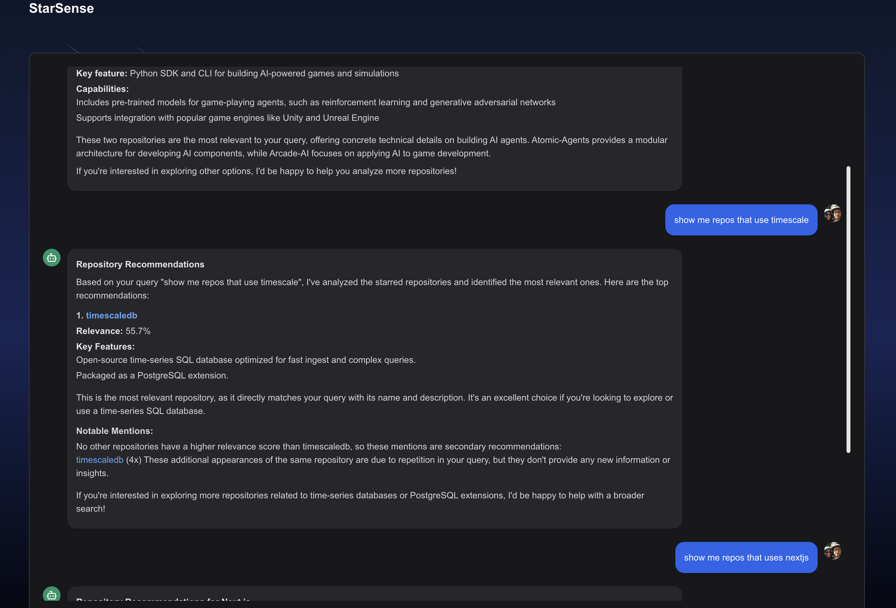
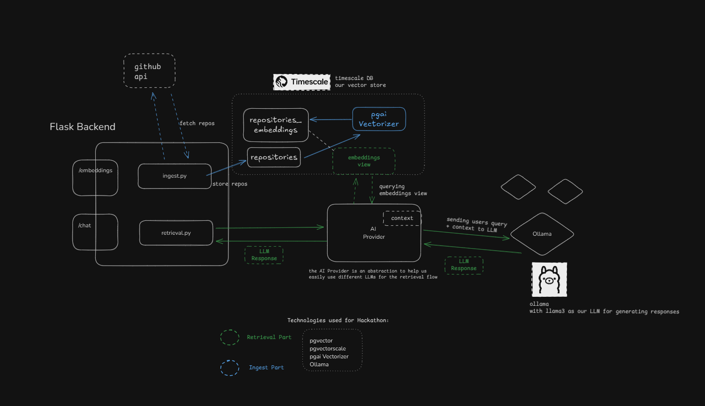
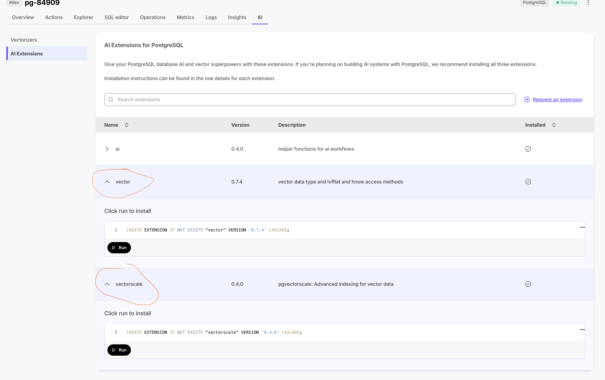
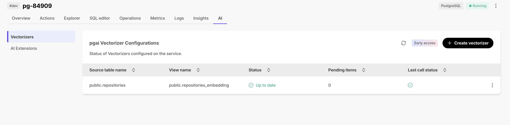

# StarSense Tutorial

## Project Overview

This project allows you to chat with your starred GitHub repositories to easily find the repos you need. It utilizes RAG (Retrieval-Augmented Generation) technology in the background. The process flow is as follows:

1. OAuth GitHub login
2. Fetch all your starred repos
3. Retrieve each repo's README
4. Insert repo information into a PostgreSQL database
5. pgai vectorizer takes care of generating embeddings for each repo
6. Use the embeddings view to query for similar repos



## Table of Contents

- [Project Overview](#project-overview)
- [Prerequisites](#prerequisites)
- [Backend Setup](#backend-setup)
- [Web Frontend Setup](#web-frontend-setup)
- [Database Setup](#database-setup)
- [GitHub OAuth Configuration](#github-oauth-configuration)
- [Running the Application](#running-the-application)
- [Testing](#testing)

## Prerequisites

- Python 3.8+
- Node.js 14+
- Timescale Account
- Ollama installed and running
- Poetry (for Python dependency management)
- npm or pnpm (for Node.js dependency management)

## Architecture



## Backend Setup

1. Navigate to the backend directory:

   ```bash
   cd backend
   ```

2. Install Poetry if you haven't already:

   ```bash
   curl -sSL https://install.python-poetry.org | python3 -
   ```

3. Add Poetry to your PATH:

   ```bash
   echo 'export PATH="$HOME/.local/bin:$PATH"' >> ~/.zshrc
   ```

   Or if using bash:

   ```bash
   echo 'export PATH="$HOME/.local/bin:$PATH"' >> ~/.bash_profile
   ```

4. Restart your terminal or run:

   ```bash
   source ~/.zshrc  # or ~/.bash_profile
   ```

5. Install dependencies:

   ```bash
   poetry install
   ```

6. Copy the `.env.example` file to `.env` and configure the necessary environment variables:

   ```bash
   cp .env.example .env
   ```

7. Start the backend server:
   ```bash
   poetry run uvicorn server:app --host 0.0.0.0 --port 8000 --reload
   ```

## Web Frontend Setup

1. Navigate to the web directory:

   ```bash
   cd web
   ```

2. Install dependencies:

   ```bash
   npm install
   # or if using pnpm
   pnpm install
   ```

3. Copy the `.env.example` file to `.env` and configure the necessary environment variables:

   ```bash
   cp .env.example .env
   ```

4. Start the development server:
   ```bash
   npm run dev
   # or with pnpm
   pnpm dev
   ```

## Database Setup

1. Create a timescale account if you haven't already.
2. Create a new database.
3. In Timescale Console > Project Settings, click AI Model API Keys.
   Click Add AI Model API Keys, add your key, then click Add API key.

   In AI Extensions make sure to install the following extensions:

   - ai
   - vector
   - vectorscale

   

4. Create the necessary table to store repository information:

   ```sql
   CREATE TABLE repositories (
     id SERIAL PRIMARY KEY,
     github_username TEXT NOT NULL,
     name TEXT NOT NULL,
     full_name TEXT NOT NULL,
     description TEXT,
     readme TEXT,
     url TEXT NOT NULL,
     language TEXT,
     stars INTEGER,
     created_at TIMESTAMP WITH TIME ZONE DEFAULT CURRENT_TIMESTAMP
   );
   ```

5. Create the vectorizer:

   ```sql
   SELECT ai.create_vectorizer(
     'public.repositories'::regclass,
     embedding=>ai.embedding_openai('text-embedding-3-small', 1536, api_key_name=>'OPENAI_API_KEY'),
     chunking=>ai.chunking_recursive_character_text_splitter('readme'),
     formatting=>ai.formatting_python_template('name: $name url: $url content: $chunk')
   );
   ```

   

6. Add your database connection details to `backend/.env`:
   ```
   DATABASE_URL=your_timescale_db_connection_string
   ```

## Setup Ollama

We will use ollama for generating the response.
Learn how to setup ollama from [here](https://github.com/ollama/ollama).
Make sure you have llama3 model downloaded and the server is running.

## GitHub OAuth Configuration

1. Register a new OAuth application on GitHub:

   - Go to your GitHub account settings
   - Navigate to "Developer settings" > "OAuth Apps" > "New OAuth App"
   - Set the "Authorization callback URL" to `http://localhost:3000/api/auth/callback/github`

2. Once registered, you'll receive a Client ID and Client Secret.

3. Add these credentials to your `web/.env` file:
   ```
   GITHUB_CLIENT_ID=your_client_id
   GITHUB_CLIENT_SECRET=your_client_secret
   ```

## Running the Application

1. Start the backend server (from the backend directory):

   ```bash
   poetry run uvicorn server:app --host 0.0.0.0 --port 8000 --reload
   ```

2. Start the web frontend (from the web directory):

   ```bash
   npm run dev
   # or with pnpm
   pnpm dev
   ```

3. Access the application in your web browser at `http://localhost:3000`

## Testing

To run the test suite, navigate to the backend directory and execute:

```bash
poetry run pytest test.py
```

This will run all the tests and display the results, including test coverage and any failures or errors that may occur.
